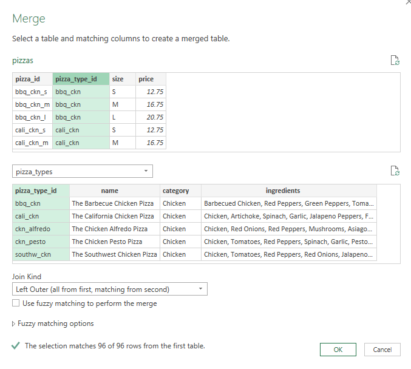
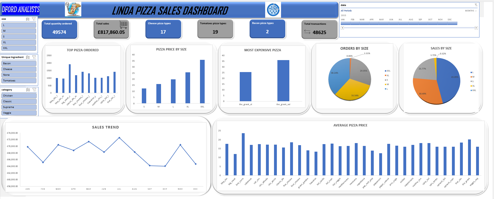

# LINDA-PIZZA-PROJECT

___

## Introduction
It is a Microsoft Excel project on the sales analysis of **Linda Pizza**, I analysed their year sales as a data analyst for Dford which is their sole ingredient supplier. The project was aimed at analysing their sales trend for the year with the view of opening new branches and getting a better market.

## Problem statement/tasks
1. How many pizza types contain cheese?
2. How many pizza types contain tomatoes?
3. How many pizza types contain bacon?
4. Create a visual to show the highest 10 pizza ID ordered.
5. Create a visual to show the average prize of each pizza size.
6. Create a visual to show the average prize of each pizza type regardless of size.
7. Create a visual to show what visual is the most expensive pizza in general.
8. Create a dashboard for the visuals.
9. Give recommendations as a data analyst for Dford on guidelines for partnering with Linda.

## Skills demonstrated
- Data cleaning
- Data manipulation and transformation in power query
- Filtering
- Sorting
- Pivot tables
- Visualization

## File merging using power query
Relationships between the csv files were not detected automatically but I was able to combine them with their respective relatable columns.

___

## Visualization
The dashboard has six visuals:
- Top Pizza ordered
- Pizza price by size
- Most expensive pizza
- Sales by size
- Orders by size
- Sales trend
- Average pizza prize

The dashboard has specific filters for filtering the data and pushing the dashboard to focus on specific views. The timeline can be used to narrow the data down to specific month or months of the year and the slicers can be used to visualize the data in terms of size, category or unique ingredients used. The dashboard also displays the total quantity ordered, total sales, total transactions that occured during the year and was also able to answer project questions like the number of pizza types that had cheese, bacon and tomatoes as their unique ingredients. 

___

## Recommendation/Insights
- According to Linda Pizza’s sales data for the previous year, the most ordered pizza was the big_meat_s accounting for 3.8% of their total order and the next was thai_ckn_l which accounted for 2.8% of their total order. At the other end of the spectrum, the_greek_xxl 
  and green_garden_l were the least pizza ordered, accounting for only 0.056% and 0.19% respectively. The price of the big_meat_s pizza is below the average pizza price of £16 which suggests the high number of orders and it shows that a reasonable portion of their    
  customer base like classic pizza and cheese is a major ingredient. It is recommended that Linda Pizza should have a healthy supply of the big_meat_s and the thai_ckn_l as they are sure routes for profit maximization.
- The most expensive pizza on their menu is the_greek_xxl for £35.95 and the cheapest is the pepperoni_s for £9.75, it is recommended that they should have very little or no supply of the_greek_xxl pizza due to its poor performance on the sales trend all through the 
   year.
- Their most-sold pizza size was the L (large) accounting for 45.89% of their total sales and the least sold was the XXL (2 extra-large) accounting for only 0.12% of total sales. It is recommended that supply should be focused on only L (large), S (small) and M 
  (medium) sizes.
- According to the sales trend, the month that had the most revenue generation was July (£72,557.90) while the least revenue came in between September (£64,180.05) and October (£64,027.60). All through the year, their chicken pizza category sold between £17,000 to  
  £15,000 worth but had its highest mark above the 17k mark in March and November but fell below £15,000 in October, the classic category experienced a drop of 11.4% decrease in sales between July to October. The supreme category also experienced a 16% decrease in 
  sales between July and September and the veggie category sold and brought in its lowest in October after experiencing an 18% decrease between July and September. It is recommended that Linda Pizza should have less supply in September and October.
